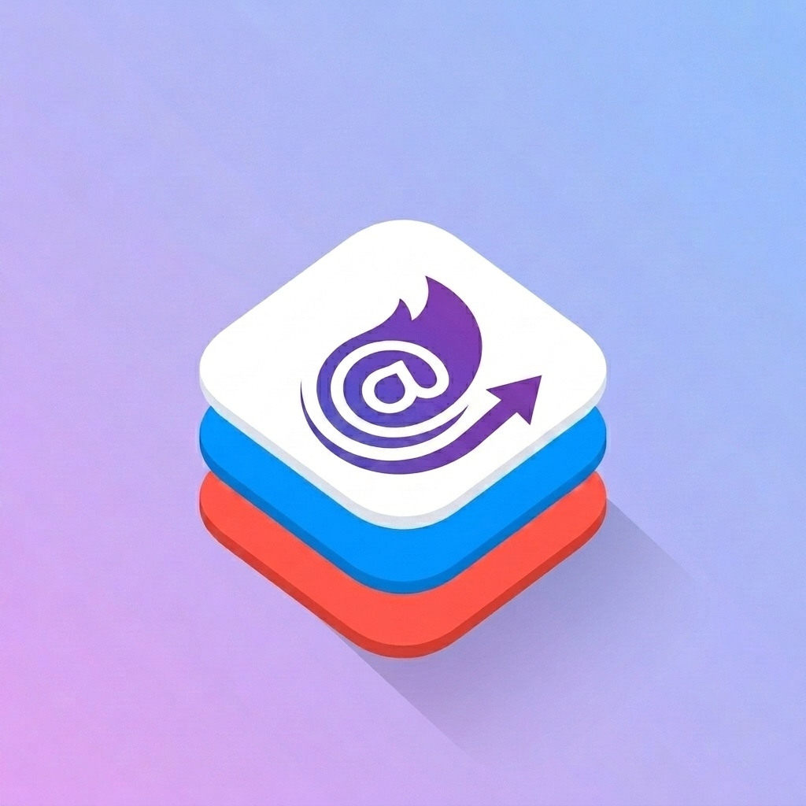

<div align="center">



# IOSwipeView

**Native Apple iOS swipe actions, physics springs, and list transitions for Blazor.**

[](https://dotnet.microsoft.com/)
[](https://dotnet.microsoft.com/apps/aspnet/web-apps/blazor)
[](LICENSE.txt)
[]()

</div>

---

**IOSwipeView** provides iOS-grade swipe drawers, physics springs, multi-stage drag-to-trigger actions, and a high-level generic `<SwipeList<TItem>>` component with iOS Edit Mode multi-selection and animated row transitions for Blazor (WebAssembly & Server).

---

## Features

- **Native Swipe Physics** — Damped harmonic springs (`Bouncy`, `Snappy`, `Smooth`, `Stiff`), rubber-band stretch resistance, and device haptic feedback.
- **Generic `<SwipeList<TItem>>`** — Coordinated list container with automatic accordion management, hairline dividers, item templates, and empty state slots.
- **9 Deletion Animation Styles** — Smooth CSS Grid row-collapse transitions:
  - `AppleSpring` (Classic iOS Mail spring height collapse)
  - `SlideLeft` / `SlideRight` (Directional fling)
  - `ShrinkSlideLeft` / `ShrinkSlideRight` (Momentum scale & fling)
  - `ScaleDown` (Inward shrink)
  - `PopOut` (Elastic spring micro-pop)
  - `CardFold` (3D perspective fold)
  - `Fade` (Dissolve)
  - `None` (Instant removal)
- **iOS Edit Mode** — Multi-selection mode with sliding circular checkmarks, selection pulses, gesture locking, and atomic batch deletion.
- **Multi-Stage Progressive Triggers** — Configure multiple triggers on the same side (`TriggerStage="1"`, `TriggerStage="2"`) with progressive pull thresholds and icon micro-pops.
- **Stock Apple Presets** — `ClassicList`, `InsetGrouped`, `Notification`, and `Capsule`.
- **Full RTL Support** — Built with CSS logical properties, automatically adapting to Right-to-Left writing modes (Kurdish, Arabic, Hebrew).
- **Accessible** — Operable via keyboard navigation (`Tab`, `Arrows`, `Delete`, `Escape`) with support for `prefers-reduced-motion`.

---

## Installation

Install via NuGet:

```bash
dotnet add package IOSwipeView
```

Add the namespace to `_Imports.razor`:

```razor
@using IOSwipeView
```

---

## Quick Start

### 1. High-Level List (`<SwipeList<TItem>>`)

```razor
<SwipeList Items="@Contacts"
           ListOptions="SwipeListOptions.ClassicList"
           OnItemDeleted="contact => Contacts.Remove(contact)">
    
    <!-- Leading swipe drawer (Swipe right) -->
    <LeadingActions Context="ctx">
        <SwipeAction Background="#34c759" Foreground="white" OnInvoked="() => Call(ctx.Item)">
            Call
        </SwipeAction>
    </LeadingActions>

    <!-- Main row content -->
    <ItemTemplate Context="contact">
        <div class="p-3">
            <h4 class="font-medium text-gray-900">@contact.Name</h4>
            <p class="text-sm text-gray-500">@contact.Email</p>
        </div>
    </ItemTemplate>

    <!-- Trailing swipe drawer (Swipe left) -->
    <TrailingActions Context="ctx">
        <SwipeAction Background="#ff9500" Foreground="white" OnInvoked="() => Star(ctx.Item)">
            Star
        </SwipeAction>
        <SwipeAction Background="#ff3b30" Foreground="white" TriggerStage="1"
                     OnInvoked="() => ctx.DeleteAsync()">
            Delete
        </SwipeAction>
    </TrailingActions>

    <!-- Empty state slot -->
    <EmptyContent>
        <p class="p-8 text-center text-gray-400">No remaining items</p>
    </EmptyContent>
</SwipeList>
```

---

### 2. Standalone Row (`<SwipeView>`)

Wrap individual cards, tiles, or custom components:

```razor
<SwipeViewGroup>
    <SwipeView Options="SwipeOptions.Capsule">
        <ChildContent>
            <div class="p-4 bg-white rounded-2xl shadow-sm">Swipeable Card</div>
        </ChildContent>

        <TrailingActions>
            <SwipeAction Background="#ff3b30" Foreground="white" AllowSwipeToTrigger
                         OnInvoked="OnDelete">
                Delete
            </SwipeAction>
        </TrailingActions>
    </SwipeView>
</SwipeViewGroup>
```

---

### 3. Multi-Stage Progressive Drag-to-Trigger

Declare progressive trigger thresholds on the same side:

```razor
<TrailingActions>
    <!-- Tap action -->
    <SwipeAction Background="#ff9500" Foreground="white">Flag</SwipeAction>

    <!-- Stage 1 Trigger (~200px pull) -->
    <SwipeAction Background="#34c759" Foreground="white" TriggerStage="1" OnInvoked="Archive">
        Archive
    </SwipeAction>

    <!-- Stage 2 Trigger (~280px deep pull) -->
    <SwipeAction Background="#ff3b30" Foreground="white" TriggerStage="2" OnInvoked="Delete">
        Delete
    </SwipeAction>
</TrailingActions>
```

---

## Presets

| Preset | Description | Common Use Case |
| :--- | :--- | :--- |
| **`ClassicList`** | Flush square actions, 0px spacing, hairline dividers | Mail, Messages, Chats, TableViews |
| **`InsetGrouped`** | Rounded outer section mask, flush inner actions | Inset grouped list sections, Settings |
| **`Notification`** | Rounded floating pills, 6px spacing | Notification banners, Lock Screen cards |
| **`Capsule`** | Floating bubble capsules, 8px spacing, 32px corner radius | Media feeds, floating cards, dashboards |

Customize any preset with C# `with` expressions:

```csharp
var options = SwipeListOptions.ClassicList with
{
    DividerInset = 54,
    DeleteAnimation = SwipeListAnimation.SlideLeft with { DurationMs = 280 },
    SwipeOptions = SwipeOptions.ClassicList with
    {
        ExpandAnimation = SwipeSpring.Bouncy
    }
};
```

---

## Physics Springs & Deletion Animations

```csharp
// Horizontal drawer physics springs:
SwipeSpring.Default // Responsive settle (~220ms)
SwipeSpring.Snappy  // Instant, zero bounce (~180ms)
SwipeSpring.Smooth  // Soft settle (~260ms)
SwipeSpring.Bouncy  // Playful spring oscillation
SwipeSpring.Stiff   // High tension, zero overshoot

// List row deletion transitions:
SwipeListAnimation.AppleSpring     // Classic height collapse (320ms)
SwipeListAnimation.SlideLeft       // Slide off-screen left (280ms)
SwipeListAnimation.SlideRight      // Slide off-screen right (280ms)
SwipeListAnimation.ShrinkSlideLeft // Scale 85% and slide left (280ms)
SwipeListAnimation.ScaleDown       // Inward scale down (260ms)
SwipeListAnimation.PopOut          // Elastic spring pop-out (280ms)
SwipeListAnimation.CardFold        // 3D perspective fold (300ms)
SwipeListAnimation.Fade            // Smooth dissolve (220ms)
SwipeListAnimation.None            // Instant removal (0ms)
```

---

## Keyboard Navigation

| Shortcut | Description |
| :--- | :--- |
| <kbd>Tab</kbd> / <kbd>Shift+Tab</kbd> | Move focus between interactive swipe rows |
| <kbd>←</kbd> / <kbd>→</kbd> | Open trailing / leading action drawers (RTL aware) |
| <kbd>Esc</kbd> | Close currently open drawer |
| <kbd>Delete</kbd> / <kbd>Backspace</kbd> | Trigger primary destructive action |

---

## License

MIT License. Open source and free for personal and commercial use.
